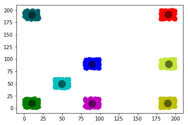

# A quantum-inspired genetic algorithm comparision with genetic algorithm for k-means clustering

## Abstract

In this paper we want to compare two diffrent algorithms for k-means clustering, first is Quantum Inspired Genetic Algorithm that we will implement it from Quantom Inspired genetic article, and second is a simple genetic algorithm from another article.

## Contents

<ul>
    <li> Introduction </li>
    <li> Quantum-inspired genetic algorithm for k-means clustering implementation </li>
    <li> Genetic algorithm for k-means clustering implementation </li>
    <li> Comparison of two algorithm </li>
    <li> Conclusion </li>
</ul>

## Introduction

Clustering plays an important role in many unsupervised learning
areas, such as pattern recognition, data mining and knowledge
discovery. Clustering problem can be summarized as: Given n
points in Rd space and an integer k, find a set of k points, called centroids,
such that the sum of the distances of each of the n points to
its nearest centroid is minimized. Generally speaking, conventional
clustering algorithms can be grouped into two main categories,
namely hierarchical clustering algorithms and partitional clustering
algorithms. A hierarchical clustering algorithm outputs a dendrogram,
which is a tree structure showing a sequence of
clusterings with each clustering being a partition of the dataset. Unlike the hierarchical clustering algorithm,
the partitional clustering algorithms partition the data set
into a number of clusters, and the output is only a single partition
of the data set. The majority of partitional clustering algorithms
obtain the partition through the maximization or minimization
of some criterion functions. Recent researches show that the partitional
clustering algorithms are well suited for clustering a large
dataset due to their relatively low computational requirements. And the time complexity of
the partitional algorithms is almost **linear**, which makes them
widely used.
Among the partitional clustering algorithms, the most famous
one is **k-means clustering**. K-means clustering
algorithm first randomly generates k initial cluster centroids. After
several iterations of the algorithm, data can be classified into certain
clusters by the criterion function, which makes the data close
to each other in the same cluster and widely separated among clusters.
However, the traditional k-means clustering algorithm has
two drawbacks. The one is that the number of clusters has to be
known in advance, and the other is that the clustering result is sensitive
to the selection of initial cluster centroids and this may lead
the algorithm converge to the local optima. Different datasets have
different number of clusters, which is difficult to known beforehand,
and the initial cluster centroids are selected randomly, which
will make the algorithm converge to the different local optima.
Therefore, a lot of research efforts have been conducted on mitigating
the two drawbacks of the conventional k-means clustering
algorithm. The **genetic algorithm** (GA) is one of the methods to
avoid local optima and discover good initial centroids that lead
to superior partitions under k-means.

## Results

## Refrenece

https://www.sciencedirect.com/science/article/pii/S095741740901063X