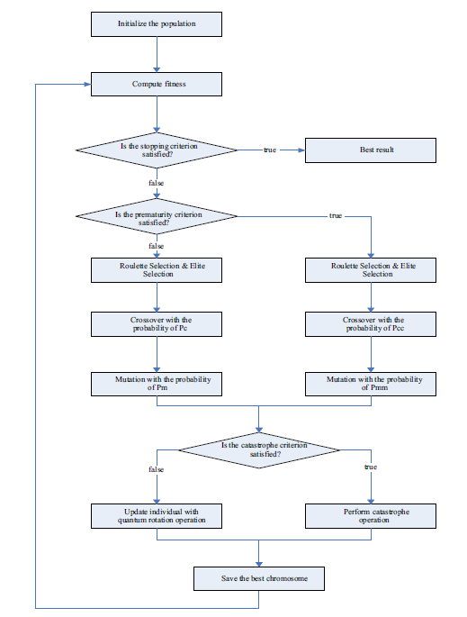

# Quantum-Inspired Genetic Algorithm for K-means Clustering 🧬🔬

[](https://www.python.org/downloads/)
[](https://python-poetry.org/)
[](https://opensource.org/licenses/MIT)
[]()
[](https://github.com/psf/black)

> A Python implementation combining quantum computing concepts with evolutionary algorithms to optimize cluster assignments, offering improved convergence over traditional methods.


## ✨ Features

- 🧬 **Quantum-Inspired Evolution**: Uses quantum principles for better exploration
- 🎯 **Optimized Convergence**: Faster convergence than traditional genetic algorithms
- 📊 **Multiple Datasets**: Support for various synthetic datasets (SDA1, SDA2, SDA3)
- 📈 **Visualization Tools**: Built-in plotting utilities for cluster analysis

## 🧪 Algorithm Overview

The QIGA represents cluster centroids using quantum-inspired bits (qubits) in superposition:

```
|ψ⟩ = cos(θ)|0⟩ + sin(θ)|1⟩
```

Key components:
- **Quantum Rotation**: Updates quantum angles based on the best solutions
- **Quantum Mutation**: Introduces diversity through random angle perturbations
- **K-means Objective**: Minimizes within-cluster sum of squared errors

<div align="center">
  
</div>


## 🚀 Quick Start

### Prerequisites

- Python 3.9+
- [Poetry](https://python-poetry.org/docs/#installation)

### Installation

```bash
# Clone the repository
git clone https://github.com/erfanmiahi/A-quantum-inspired-genetic-algorithm-for-k-means-clustering.git
cd A-quantum-inspired-genetic-algorithm-for-k-means-clustering

# Install dependencies with Poetry
poetry install
```

### Basic Usage

```python
from qiga_kmeans.algorithms import QIGA
from qiga_kmeans.utils import generate_sda_dataset

# Generate synthetic data
X = generate_sda_dataset(1)  # SDA1 dataset

# Initialize and run QIGA
qiga = QIGA(
    n_clusters=3,
    population_size=20,
    max_generations=50,
    mutation_prob=0.01,
    crossover_prob=0.8
)
labels, sse = qiga.fit(X)
```

## 🧪 Testing

```bash
# Run all tests with coverage
poetry run pytest --cov=src/qiga_kmeans

# Run specific test modules
poetry run pytest tests/unit/algorithms/  # Test all algorithms
poetry run pytest tests/unit/utils/       # Test utilities
```

## 📁 Project Structure

```
src/qiga_kmeans/
├── algorithms/      # Core algorithm implementations
│   ├── qiga.py     # Quantum-inspired genetic algorithm
│   ├── genetic.py  # Traditional genetic algorithm
│   └── kmeans.py   # Base k-means implementation
├── utils/          # Helper utilities
│   ├── data_generator.py  # Synthetic dataset generation
│   └── preprocessing.py   # Data preprocessing utilities
├── data/           # Data management
└── visualization/  # Plotting tools
```

## 📝 Citation

If you use this implementation in your research, please cite:

```bibtex
@software{qiga_kmeans,
  author = {Erfan Miahi},
  title = {A Quantum-Inspired Genetic Algorithm for K-means Clustering},
  year = {2024},
  url = {https://github.com/erfanmiahi/A-quantum-inspired-genetic-algorithm-for-k-means-clustering}
}
```

## 📄 Implementation Status

**Note:** The current implementation exists in two forms:
1. Original implementation in `implementation.ipynb` - This is the working reference implementation
2. Package implementation in `src/` directory - This is a work in progress conversion from the notebook and needs proper testing

The code in the `src/` directory is currently being refactored from the notebook format and requires:
- Complete test coverage
- Validation against original results
- Performance optimization
- Documentation improvements

Please refer to `implementation.ipynb` for the current working implementation.

## 📄 License

This project is licensed under the MIT License - see the [LICENSE](LICENSE) file for details.

---
<div align="center">
Made with ❤️ by Erfan Miahi
</div>